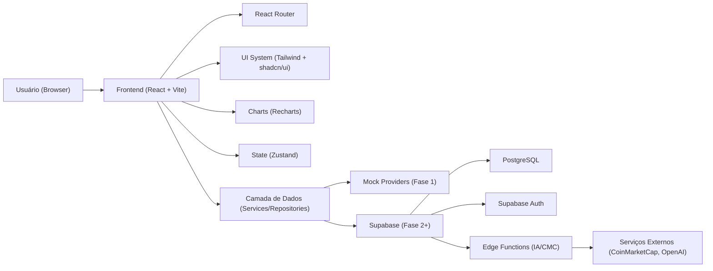
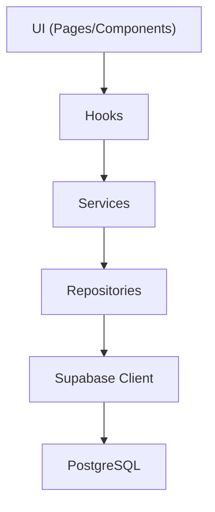
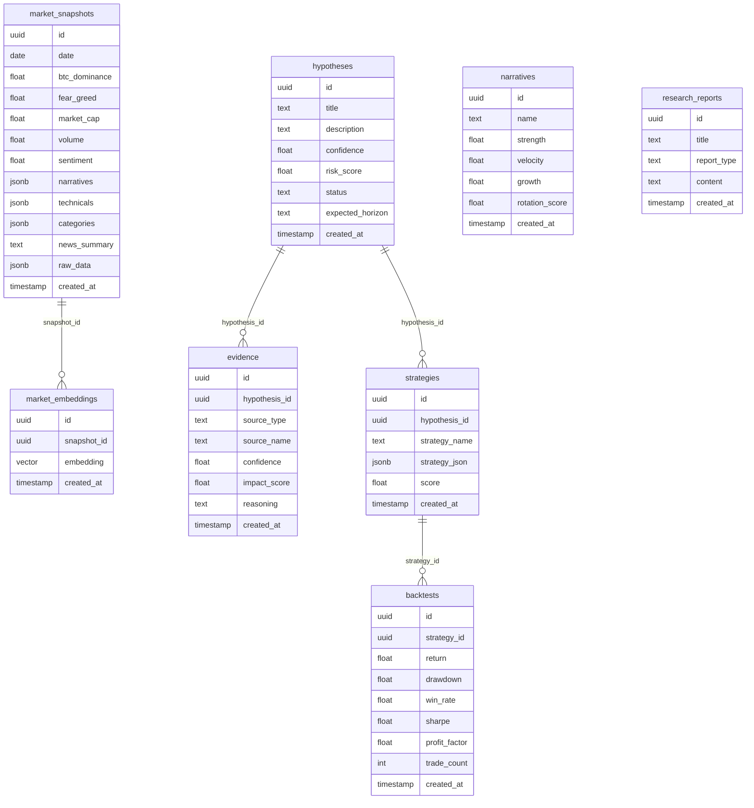

## 1. Desenho de Arquitetura



## 2. Descrição de Tecnologias
- Frontend: React@18 + TypeScript + Vite
- Roteamento: react-router-dom
- UI: Tailwind CSS + shadcn/ui (Radix)
- Charts: Recharts
- State: Zustand
- Backend (Fase 2+): Supabase (PostgreSQL + Auth + Edge Functions)
- IA (Fase 3+): OpenAI via Edge Functions, com fallback mock se não houver chave
- Dados Externos (Fase 3+): CoinMarketCap via Edge Functions, com cache e mocks

## 3. Definições de Rotas
| Rota | Propósito |
|------|-----------|
| / | Redirecionar para /landing (ou abrir /dashboard quando autenticado) |
| /landing | Página institucional do produto |
| /dashboard | Tela principal com oportunidades e painéis de mercado |
| /hypotheses | Central de hipóteses |
| /hypotheses/:id | Detalhe de hipótese com evidências |
| /market-memory | Explorer e timeline de memória de mercado |
| /market-replay | Player de replay histórico |
| /strategy-lab | Laboratório de evolução de estratégias |
| /research | Biblioteca e viewer de relatórios |
| /settings | Preferências e conta |

## 4. Definições de APIs (quando houver backend)
As interações entre UI e dados seguem abstrações estáveis para permitir mock → real sem quebrar páginas.

### 4.1 Contratos (TypeScript)
```ts
export type ApiResult<T> =
  | { ok: true; data: T }
  | { ok: false; error: { message: string; code?: string } }
```

## 5. Diagrama de Camadas do Servidor (Fase 2+)



## 6. Modelo de Dados (planejado)

### 6.1 ER (alto nível)


### 6.2 DDL (será implementado na Fase 2)
A definição exata de tabelas, grants e RLS será criada junto da integração do Supabase, mantendo chaves sensíveis apenas em ambiente server-side (Edge Functions).

