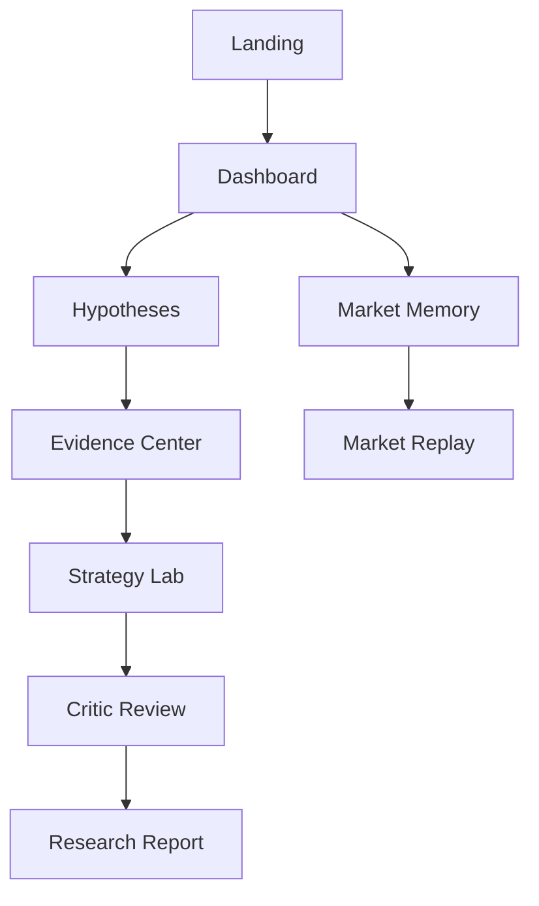

## 1. Visão Geral do Produto
AlphaOS é um Market Intelligence Operating System que transforma dados do CoinMarketCap em Market Memory, Narrative Intelligence e Alpha Discovery.
O objetivo é responder: “Quais oportunidades o mercado ainda não está vendo?” com pesquisa explicável e padrão institucional.

## 2. Funcionalidades Centrais

### 2.1 Papéis de Usuário (quando aplicável)
| Papel | Método de acesso | Permissões centrais |
|------|------------------|---------------------|
| Visitante | Sem login | Acessar a landing e visualizar exemplos/demonstrações |
| Usuário autenticado | Supabase Auth | Acessar módulos do app, salvar preferências e operar fluxos de pesquisa |

### 2.2 Módulos e Páginas
1. **Landing (/landing)**: posicionamento institucional, seções de produto, CTA para explorar e ver relatórios.
2. **Dashboard (/dashboard)**: “Today’s Alpha”, regime de mercado, radar de narrativas, rotação e pulse do mercado.
3. **Hypotheses (/hypotheses)**: listagem e detalhe de hipóteses com evidências e explicabilidade.
4. **Market Memory (/market-memory)**: explorer de snapshots, timeline, comparação e mercados similares.
5. **Market Replay (/market-replay)**: experiência de replay de período histórico (player + timeline + eventos).
6. **Strategy Lab (/strategy-lab)**: pipeline Hypothesis → Generate → Backtest → Critic → Approved, com comparações e rankings.
7. **Research (/research)**: biblioteca, viewer e geração de relatórios institucionais.
8. **Settings (/settings)**: preferências, modo demo, chaves/configurações (sem expor segredos no frontend), tema e conta.

### 2.3 Detalhes por Página
| Página | Módulo | Descrição de funcionalidade |
|------|--------|------------------------------|
| /landing | Hero | Headline “The Market Intelligence Operating System”, subheadline, CTA primário/segundário |
| /landing | Seções de produto | Market Memory, Narrative Intelligence, Alpha Discovery, Strategy Evolution, Research Engine |
| /dashboard | Today’s Alpha Opportunities | Cards com nome, confidence, risk, regime, narrativa, horizonte esperado (inicialmente mock) |
| /dashboard | Market Regime Card | Regime atual, confiança, risco e condições do mercado (mock) |
| /dashboard | Narrative Radar | Radar em tempo real com força por narrativa (mock) |
| /dashboard | Narrative Rotation | Fluxos de rotação de capital entre narrativas (mock) |
| /dashboard | Market Pulse | BTC dominance, fear & greed, market cap, volume, sentimento, news momentum (mock) |
| /market-memory | Timeline + Explorer | Navegação por snapshots diários, busca e comparação entre períodos (mock) |
| /market-memory | Similar Markets | Similarity score, contexto histórico e “what happened next” (mock de embeddings/similaridade) |
| /market-replay | Player | Controles (play/pause/speed), eventos e progressão de período (mock) |
| /hypotheses | Hypothesis Center | Cards com confidence, risk, evidence count, horizon e status (mock) |
| /hypotheses/:id | Evidence Center | Evidências por fonte, confiança, impacto e reasoning; sem “black box” |
| /strategy-lab | Pipeline | Visualização do fluxo completo e status por etapa (mock) |
| /strategy-lab | Comparação | Tabela/cards de estratégias (50 mock), ranking e export JSON |
| /research | Research Library | Lista de relatórios, filtros e viewer profissional (mock) |
| /settings | Preferências | Configurações do app, conta e modo demo |

## 3. Processo Central
Fluxo principal esperado:
1) Usuário acessa a landing e entende o posicionamento institucional.
2) Usuário entra no dashboard e explora oportunidades e narrativas do dia.
3) Usuário abre uma hipótese e analisa evidências e explicações.
4) Usuário explora Market Memory para analogias históricas e comparações.
5) Usuário evolui hipótese em estratégias, revisa no Critic e gera relatório.

## 4. Design e Experiência

### 4.1 Estilo Visual
- Tema: Dark premium, institucional, sem neon e sem estética “meme”
- Tipografia: hierarquia forte, leitura confortável e aparência de produto financiado
- Componentes: shadcn/ui como base, customização para “Bloomberg/Linear/Stripe”
- Motion: animações sutis (transições, hover, loaders), sem exageros
- Prioridade: insights e narrativa antes de gráficos

### 4.2 Diretrizes de UI por Página (visão)
| Página | Módulo | Elementos de UI |
|------|--------|------------------|
| /dashboard | Cards e painéis | Cards com métrica, badges, estados vazios/erro, skeletons, densidade controlada |
| /market-memory | Timeline | Visual premium com contexto e comparações claras, foco em memória de mercado |
| /market-replay | Player | Interface estilo “Netflix para inteligência de mercado” (playback + eventos) |
| /research | Viewer | Layout “PDF-ready”, tipografia editorial/institucional |

### 4.3 Responsividade
Desktop-first; tablet otimizado; mobile funcional e legível, sem “apertar tudo”.

